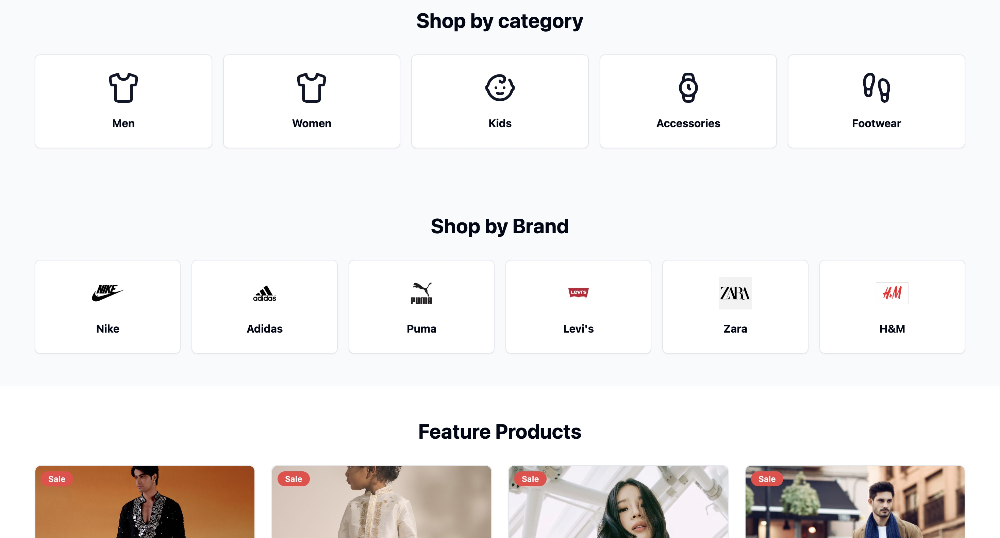
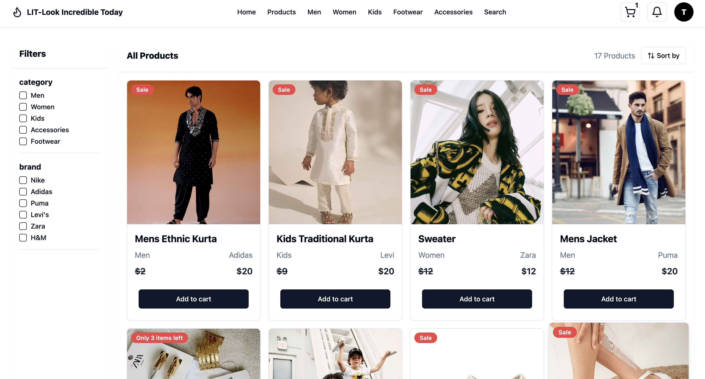
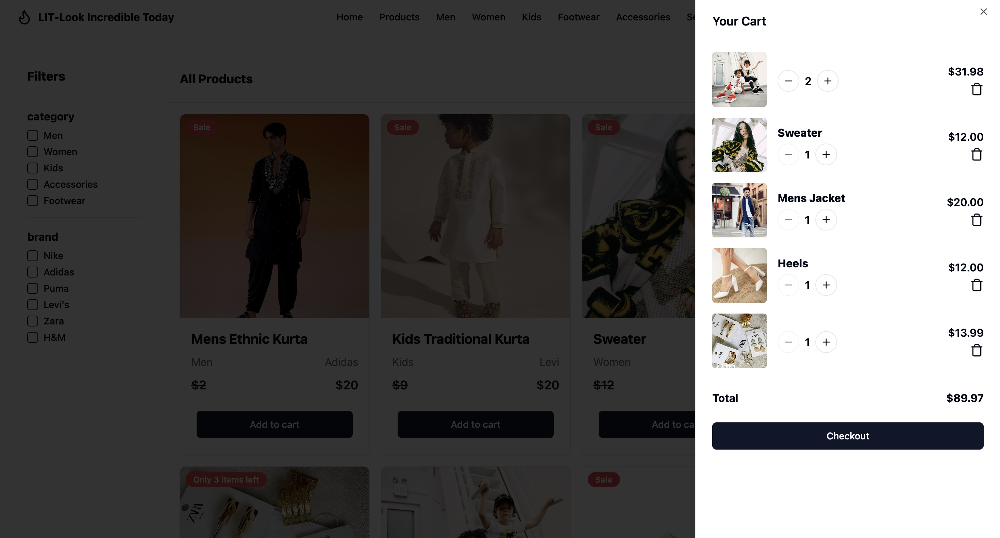
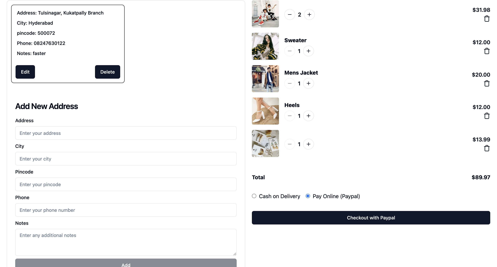
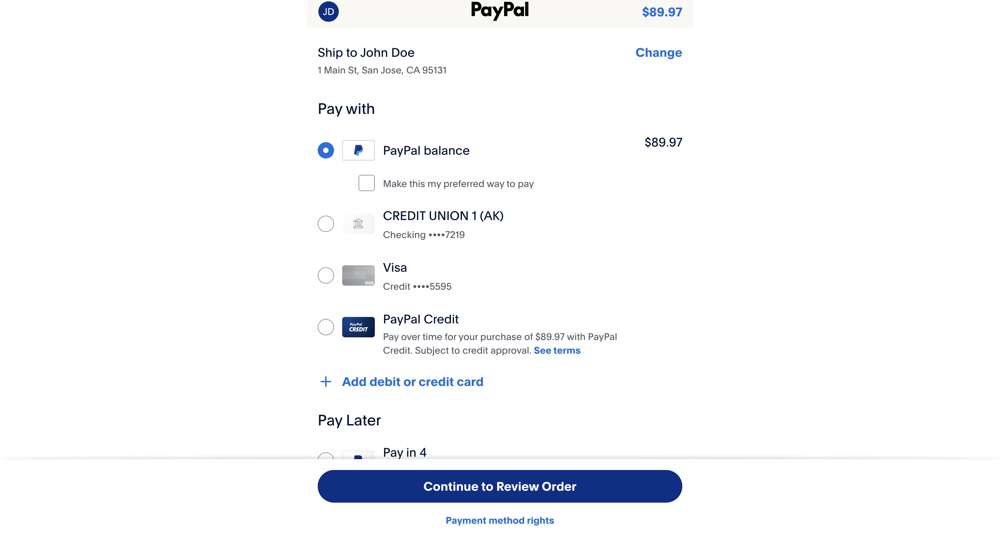
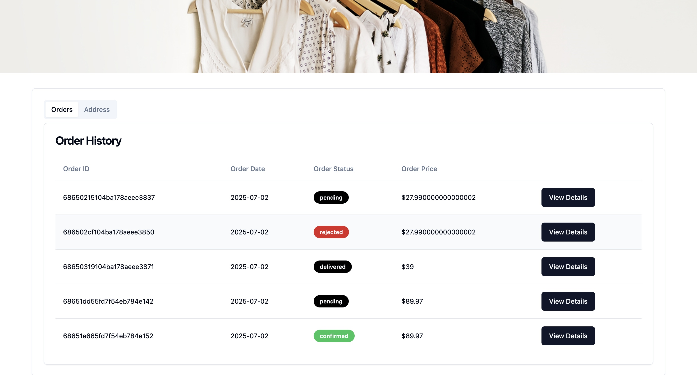
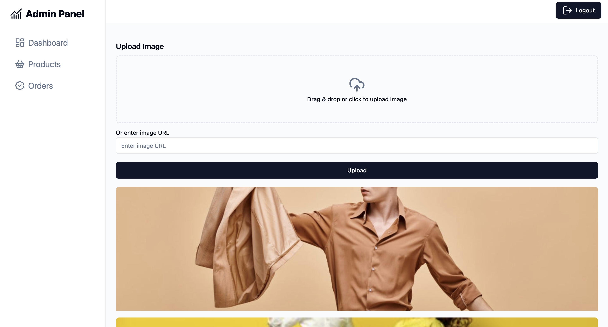
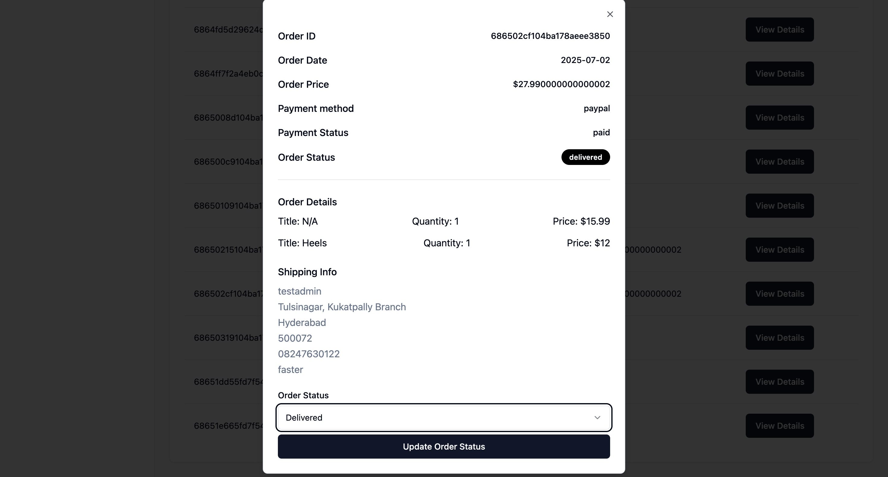

# 🛍️ LITecommerce — Look Incredible Today

## Project Overview
LIT-ECommerce is a full-stack e-commerce web application designed to provide a seamless shopping experience. It includes features for product browsing, shopping cart management, order processing, and an admin panel for managing products, orders, and notifications.

-----

## 🚀 Live Demo

- 🔗 Frontend: [https://lit-e-commerce.vercel.app](https://lit-e-commerce.vercel.app)
- 🔗 Backend API: [https://lit-ecommerce.onrender.com](https://lit-ecommerce.onrender.com)

-----

## 📦 Features

- Responsive UI built with React and Tailwind CSS
- RESTful API backend with Node.js and Express
- State management using Redux Toolkit

### 👤 User Features
- User registration and login (with secure authentication)
- Product listing and detailed views
- Add to cart and checkout process
- PayPal payment integration (sandbox)
- View order history and status

### 🛠️ Admin Features
- View all orders
- Admin dashboard for managing featured products
- Order management with status updates
- Update order delivery status
- Access user database

-----

## 🧰 Tech Stack

| Layer     |Technologies                                                                 |
|-----------|-----------------------------------------------------------------------------|
| Frontend  | React, Redux Toolkit, Tailwind CSS + ShadCN UI, React Router DOM, Axios     |
| Backend   | Node.js, Express.js, JWT Auth + Cookies, CORS with `sameSite=None`          |
| Database  | MongoDB (Mongoose)                                                          |
| Payment   | PayPal REST API (Sandbox)                                                   |
| Deployment| Vercel (frontend), Render (backend)                                         |

-----

## 📁 Folder Structure

LITecommerce/
│
├── client/          # React frontend
│   ├── src/
│   ├── public/
│   └── .env         # VITE_API_URL
│
├── server/          # Express backend
│   ├── controllers/
│   ├── models/
│   ├── helpers/
│   ├── routes/
│   ├── seed/
│   ├── server.js
│   └── .env         # Cloudinary credentials, PayPal credentials

-----

## Installation

### Prerequisites
- Node.js (v16 or higher recommended)
- npm or yarn
- MongoDB (for database)

### Backend Setup
1. Navigate to the `server` directory:
   cd server
   
2. Install dependencies:
   npm install

3. Configure environment variables (create a `.env` file) with necessary keys such as MongoDB URI, PORT, and PayPal credentials.
4. Start the backend server:
   npm start
   

### Frontend Setup
1. Navigate to the `client` directory:
   cd client
   
2. Install dependencies:
   npm install
   
3. Configure environment variables (create a `.env` file) with necessary keys such as VITE_API_URL pointing to backend.

4. Start the frontend development server:
   npm run dev
   
5. Open your browser and go to the port specified by Vite.

## 🧪 Sandbox Login & Payment

Use PayPal sandbox credentials:
- PayPal Buyer Sandbox: https://sandbox.paypal.com
- (Optional) Use credentials from [https://developer.paypal.com](https://developer.paypal.com)

You can also register a new user directly on the site.

-----

## 🔒 Environment Variables

# Backend .env

PORT=10000
MONGO_URI=your_mongo_connection_string
PAYPAL_CLIENT_ID=your_sandbox_id
PAYPAL_CLIENT_SECRET=your_sandbox_secret
PAYPAL_MODE=sandbox

# Frontend .env

VITE_API_URL=https://lit-ecommerce.onrender.com

-----

## Usage
- Register or log in as a user to browse products and place orders.
- Admin users can log in to access the admin dashboard to manage products, orders, and notifications.
- Update order statuses and send notifications from the admin order details page.

## Development Guidelines
- The frontend is built with React, using functional components and hooks.
- State management is handled with Redux Toolkit.
- UI components use Tailwind CSS for styling.
- The backend is built with Node.js and Express, following RESTful API principles.
- MongoDB is used as the database, with Mongoose for object modeling.

## Testing
- Manual testing can be done by navigating through the UI and performing key actions such as placing orders, updating order statuses, and managing products.
- Automated tests (if any) can be run using the test scripts defined in the `package.json` files.

## Deployment
- Backend and frontend can be deployed separately.
- Ensure environment variables are properly set in the production environment.
- Use process managers like PM2 for backend deployment.
- Frontend can be built using `npm run build` and served via static hosting or CDN.

-----

## 📸 Screenshots

### 🔐 Auth (Login/Register)

### 🏠 Home Page

### 🔍 Product Filters

### 🛍️ Products Page

### 🧾 Product Reviews

### 🛒 Cart Page

### 💳 Checkout Page

### 🧾 PayPal Checkout

### 💸 Payments

### 🧾 Order History

### ⚙️ Admin Dashboard

### 📦 Manage Orders (Admin)

-----

## 💡 Author

Made with ❤️ by Sravya Katta
